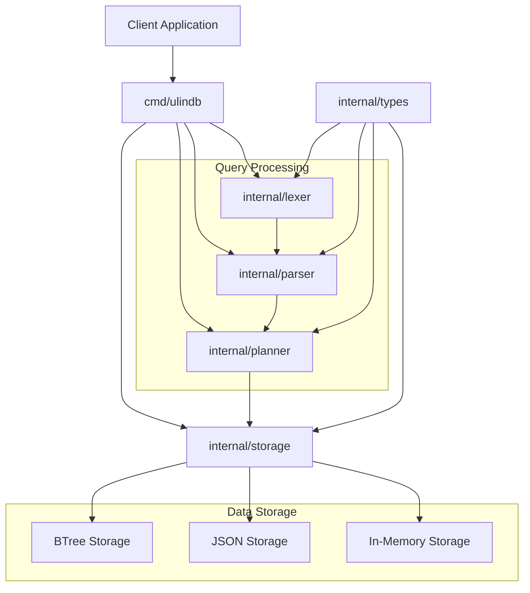
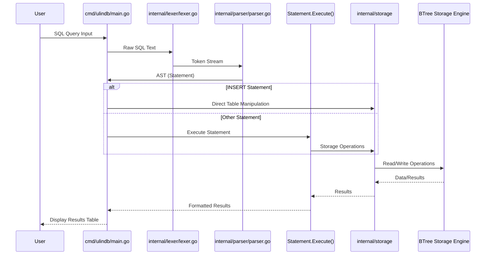
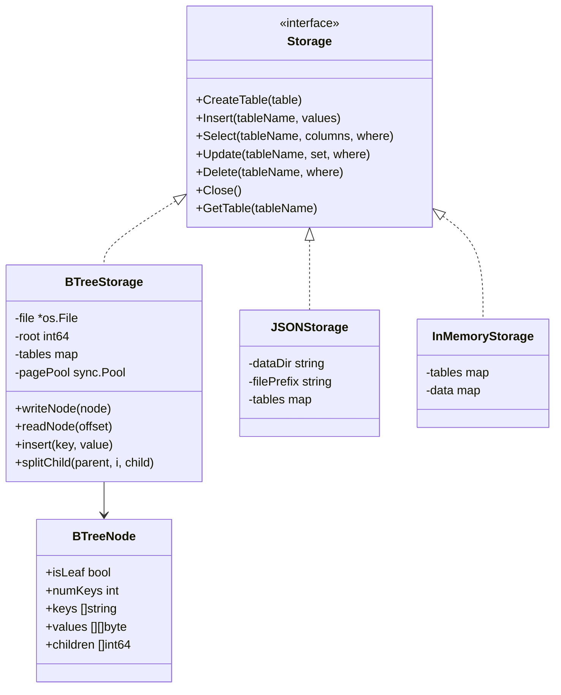

# UlinDB

A lightweight SQL database built in Go for educational purposes. UlinDB helps understand the fundamentals of database systems including parsing, query planning, and storage engines.

## Features

- Simple SQL syntax support
- Multiple storage engines (BTree, JSON, In-Memory)
- Custom-built lexer and parser
- Disk persistence with BTree storage
- Basic CRUD operations

## Architecture

### System Components



### SQL Processing Flow



### Understanding the Architecture

The UlinDB architecture is designed with modularity in mind, separating concerns into distinct components:

1. **Component Diagram Explanation:**
   - The entry point is `cmd/ulindb`, which coordinates all database operations
   - `internal/lexer` breaks SQL text into tokens (lexical analysis)
   - `internal/parser` converts tokens into an Abstract Syntax Tree (AST)
   - `internal/planner` optimizes and plans query execution
   - `internal/storage` provides a unified interface to different storage backends
   - `internal/types` contains shared data structures used across components

2. **SQL Flow Explanation:**
   - User input is processed by the main application
   - The lexer tokenizes the SQL statement
   - The parser converts tokens into a structured AST
   - INSERT statements are handled specially for column mapping
   - The statement executes against the selected storage engine
   - Results are formatted and returned to the user

This clean separation makes it easy to modify or extend individual components without affecting the rest of the system.

## Getting Started

### Prerequisites

- Go 1.19 or higher

### Installation

1. Clone the repository:
   ```
   git clone https://github.com/zakazai/ulin-db.git
   cd ulin-db
   ```

2. Build the server:
   ```
   go build -o ulindb ./cmd/ulindb
   ```

### Running UlinDB

#### Interactive Mode

Run UlinDB in interactive mode:

```
./ulindb
```

This will start the database server with a command prompt where you can enter SQL statements.

#### Test Mode

Run with predefined SQL test queries:

```
./run.sh
```

This script builds the database, runs a series of test SQL statements, and shows the results.

### Example Usage

Here are some basic SQL commands you can use:

```sql
-- Create a table
CREATE TABLE users (id INT, name STRING, age INT);

-- Insert data
INSERT INTO users VALUES (1, 'John', 25);

-- Query data
SELECT id, name, age FROM users WHERE id = 1;

-- Update data
UPDATE users SET age = 26 WHERE id = 1;

-- Delete data
DELETE FROM users WHERE id = 1;
```

## Development

### Project Structure

- `cmd/ulindb`: Main application entry point
- `internal/lexer`: SQL tokenization
- `internal/parser`: SQL parsing and AST building
- `internal/planner`: Query planning and optimization
- `internal/storage`: Storage engines implementation
- `internal/types`: Common type definitions
- `scripts`: Utility scripts for testing and development

### Testing

Run all tests:

```
go test ./...
```

Run tests for a specific package:

```
go test ./internal/lexer
```

Run a specific test:

```
go test ./internal/lexer -run=TestLexer/Select_single_column -v
```

### Storage Engines

UlinDB supports multiple storage engines:

1. **BTree (Default)**: Persistent on-disk storage using a custom B-tree implementation
2. **JSON**: Simple file-based storage using JSON files
3. **In-Memory**: Volatile storage for testing and development



To change the storage engine, modify the `main.go` file in the `cmd/ulindb` directory by updating the storage configuration:

```go
// Use BTree storage (default)
config := storage.StorageConfig{
    Type:     storage.BTreeStorageType,
    FilePath: "data/ulindb.btree",
}

// Or use JSON storage
config := storage.StorageConfig{
    Type:       storage.JSONStorageType,
    DataDir:    "data",
    FilePrefix: "db_",
}

// Or use in-memory storage
config := storage.StorageConfig{
    Type: storage.InMemoryStorageType,
}

s, err := storage.NewStorage(config)
```

### Viewing BTree Storage

To examine the contents of a BTree database file:

```
./scripts/view_btree.sh data/ulindb.btree
```

## Contributing

Contributions are welcome! Please feel free to submit a Pull Request.

## SQL Support

Currently supported SQL operations:

- `CREATE TABLE` - Create new tables with INT and STRING columns
- `INSERT` - Insert records into tables
- `SELECT` - Query data with simple WHERE clauses (equality conditions)
- `UPDATE` - Update records with WHERE filtering
- `DELETE` - Remove records with WHERE filtering

## Future Enhancements

- Index support
- JOIN operations
- Transactions
- More complex WHERE expressions
- Additional data types

## Credits

- [toydb](https://github.com/erikgrinaker/toydb)
- [gosql](https://github.com/eatonphil/gosql)
- [Material SQL](https://github.com/MaterializeInc/materialize)