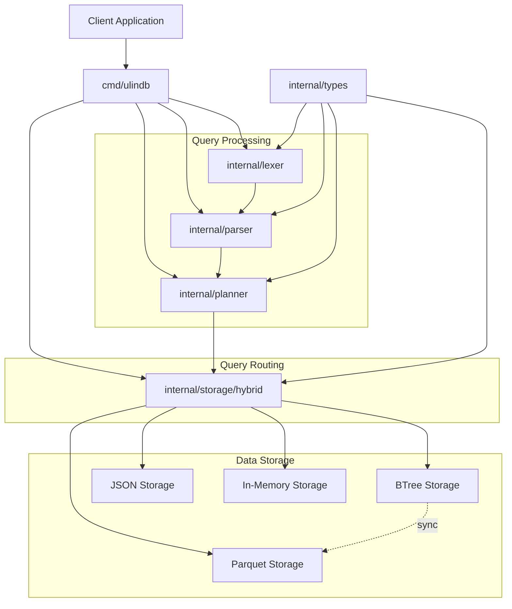
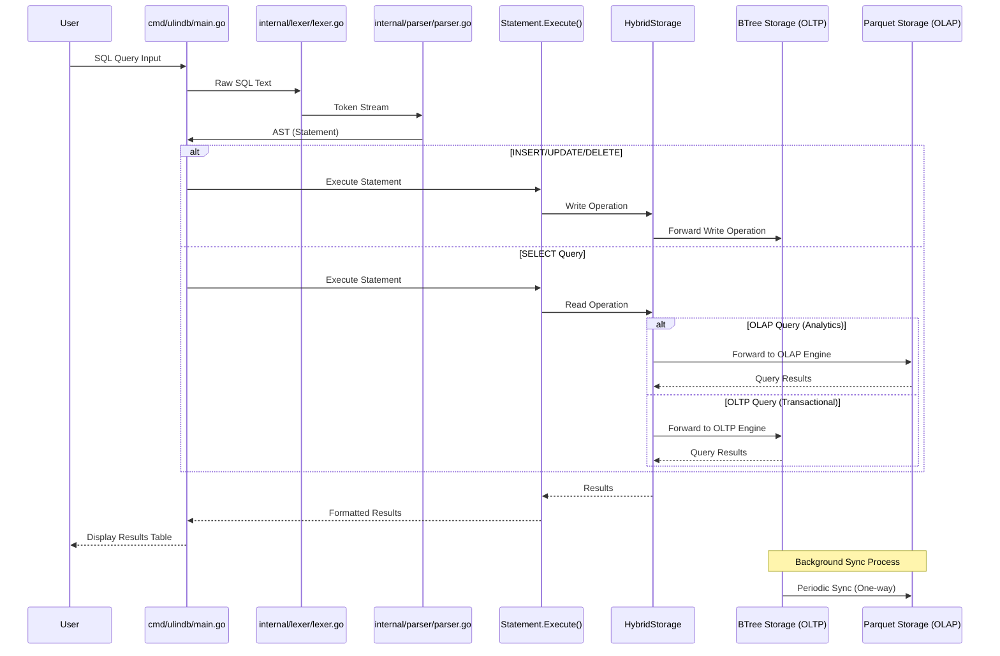
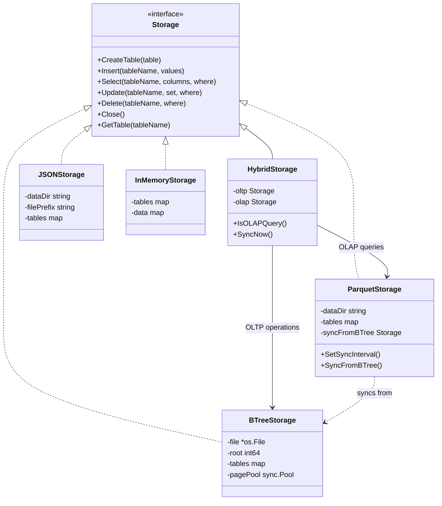

# UlinDB

A lightweight SQL database built in Go for educational purposes. UlinDB helps understand the fundamentals of database systems including parsing, query planning, and storage engines.

## Features

- Simple SQL syntax support
- Hybrid storage architecture (OLTP + OLAP)
- Apache Parquet support for analytical queries
- BTree storage for transactional workloads
- Automatic query routing based on workload type
- Custom-built lexer and parser
- Basic CRUD operations

## Architecture

### System Components



### SQL Processing Flow



### Understanding the Architecture

The UlinDB architecture is designed with modularity in mind, separating concerns into distinct components:

1. **Component Diagram Explanation:**
   - The entry point is `cmd/ulindb`, which coordinates all database operations
   - `internal/lexer` breaks SQL text into tokens (lexical analysis)
   - `internal/parser` converts tokens into an Abstract Syntax Tree (AST)
   - `internal/planner` optimizes and plans query execution
   - `internal/storage` provides a unified interface to different storage backends
   - `internal/types` contains shared data structures used across components

2. **SQL Flow Explanation:**
   - User input is processed by the main application
   - The lexer tokenizes the SQL statement
   - The parser converts tokens into a structured AST
   - The hybrid storage system routes queries based on their characteristics:
     - Write operations (INSERT/UPDATE/DELETE) go to BTree storage
     - OLAP queries (analytics) go to Parquet storage
     - OLTP queries (transactions) go to BTree storage
   - Results are formatted and returned to the user

3. **Hybrid Storage System:**
   - The `HybridStorage` acts as a router that directs operations to the appropriate engine
   - Data is persisted primarily in BTree storage (the "source of truth")
   - Parquet serves as a read-optimized replica for analytical workloads
   - A background syncing process keeps Parquet data updated from BTree
   - The routing logic analyzes query patterns to determine OLTP vs OLAP workloads

This clean separation makes it easy to modify or extend individual components without affecting the rest of the system.

## Getting Started

### Prerequisites

- Go 1.19 or higher

### Installation

1. Clone the repository:
   ```
   git clone https://github.com/zakazai/ulin-db.git
   cd ulin-db
   ```

2. Build the server:
   ```
   go build -o ulindb ./cmd/ulindb
   ```

### Running UlinDB

#### Interactive Mode

Run UlinDB in interactive mode:

```
./ulindb
```

This will start the database server with a command prompt where you can enter SQL statements.

#### Test Mode

Run with predefined SQL test queries:

```
./run.sh
```

This script builds the database, runs a series of test SQL statements, and shows the results.

### Example Usage

Here are some basic SQL commands you can use:

```sql
-- Create a table
CREATE TABLE users (id INT, name STRING, age INT);

-- Insert data
INSERT INTO users VALUES (1, 'John', 25);

-- Query data
SELECT id, name, age FROM users WHERE id = 1;

-- Update data
UPDATE users SET age = 26 WHERE id = 1;

-- Delete data
DELETE FROM users WHERE id = 1;
```

## Development

### Project Structure

- `cmd/ulindb`: Main application entry point
- `internal/lexer`: SQL tokenization
- `internal/parser`: SQL parsing and AST building
- `internal/planner`: Query planning and optimization
- `internal/storage`: Storage engines implementation
- `internal/types`: Common type definitions
- `scripts`: Utility scripts for testing and development

### Testing

Run all tests:

```
go test ./...
```

Run tests for a specific package:

```
go test ./internal/lexer
```

Run a specific test:

```
go test ./internal/lexer -run=TestLexer/Select_single_column -v
```

### Hybrid Storage Architecture

UlinDB uses a hybrid storage approach that combines different storage engines to optimize for different workloads:

1. **BTree Storage**: Optimized for OLTP (Online Transaction Processing)
   - Handles writes (INSERT, UPDATE, DELETE)
   - Efficiently serves point queries with specific WHERE clauses
   - Uses a custom B+tree implementation for quick lookups

2. **Parquet Storage**: Optimized for OLAP (Online Analytical Processing)
   - Handles analytical queries (full table scans, aggregations)
   - Columnar storage format for efficient data analytics
   - Read-only replica that syncs from BTree storage

3. **Query Router**: Automatically directs queries to the appropriate storage engine
   - OLTP queries (specific lookups) → BTree Storage
   - OLAP queries (analytical queries) → Parquet Storage
   - Fallback mechanism if data isn't available in Parquet



### Storage Engine Configuration

UlinDB uses a hybrid storage system by default, but you can configure it in the `main.go` file:

```go
// Default hybrid storage configuration (OLTP + OLAP)
config := storage.StorageConfig{
    Type:          storage.BTreeStorageType, // Primary storage
    FilePath:      "data/ulindb.btree",      // BTree storage path
    DataDir:       "data/parquet",           // Parquet storage directory
    SyncInterval:  time.Minute * 5,          // Sync every 5 minutes
}

// Create hybrid storage
hybridStorage, err := storage.CreateHybridStorage(config)

// Or use a single storage engine
config := storage.StorageConfig{
    Type:     storage.BTreeStorageType,     // Or JSONStorageType, ParquetStorageType, InMemoryStorageType
    FilePath: "data/ulindb.btree",
}
s, err := storage.NewStorage(config)
```

### Viewing Storage Contents

#### BTree Storage (OLTP)

To examine the contents of a BTree database file:

```
./scripts/view_btree.sh data/ulindb.btree
```

#### Parquet Storage (OLAP)

To view the contents of a Parquet table:

```
./scripts/view_parquet.sh data/parquet users
```

## Contributing

Contributions are welcome! Please feel free to submit a Pull Request.

## SQL Support

Currently supported SQL operations:

- `CREATE TABLE` - Create new tables with INT and STRING columns
- `INSERT` - Insert records into tables
- `SELECT` - Query data with simple WHERE clauses (equality conditions)
- `UPDATE` - Update records with WHERE filtering
- `DELETE` - Remove records with WHERE filtering

## Future Enhancements

- More advanced OLAP capabilities:
  - Aggregation functions (SUM, AVG, COUNT)
  - GROUP BY support
  - Window functions
- Two-way synchronization between storage engines
- JOIN operations
- Transactions
- Complex WHERE expressions
- Additional data types
- Query optimization for hybrid storage

## LLM
Most of the code in this repo are generated by these LLMs:
- Claude Code Agent
- Cursor
- Github Copilot

## Credits

- [toydb](https://github.com/erikgrinaker/toydb)
- [gosql](https://github.com/eatonphil/gosql)
- [Material SQL](https://github.com/MaterializeInc/materialize)
- [Apache Parquet](https://parquet.apache.org/)
- [parquet-go](https://github.com/xitongsys/parquet-go)